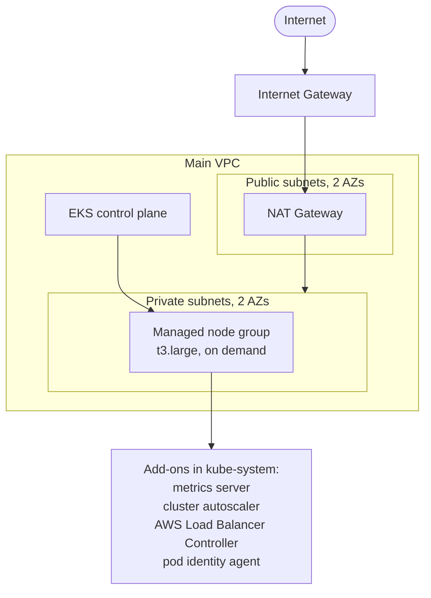

# EKS on AWS with Terraform

A complete, reproducible Amazon EKS environment provisioned with Terraform, plus Kubernetes manifests that exercise the cluster end to end. The Terraform stack builds the network, the EKS control plane, a managed node group, and four add-ons (metrics server, EKS Pod Identity, cluster autoscaler, and the AWS Load Balancer Controller). The manifests then demonstrate RBAC, horizontal pod autoscaling, node autoscaling, and load balancer provisioning.

This is a hands on learning build. The remote state is named `eks-journey` and the node group is labeled as a practice environment.

## Architecture



The worker nodes run in private subnets and reach the internet through a NAT gateway. The cluster API endpoint is public. Public subnets are tagged for internet facing load balancers and private subnets for internal ones, so the AWS Load Balancer Controller can place load balancers correctly.

## Repository structure

```
eks/
├── terraform/                  All infrastructure as code
│   ├── 0-variables.tf          Input variables
│   ├── 1-providers.tf          AWS provider and version pins
│   ├── backend.tf              S3 remote state with native lockfile
│   ├── 2-vpc.tf                VPC
│   ├── 3-igw.tf                Internet gateway
│   ├── 4-subnets.tf            Two public and two private subnets
│   ├── 5-nat.tf                Elastic IP and NAT gateway
│   ├── 6-route_tables.tf       Public and private route tables
│   ├── 7-eks.tf                EKS cluster and its IAM role
│   ├── 8-eks_nodes.tf          Managed node group and its IAM role
│   ├── 9-add-users.tf          Developer IAM user, group, and assumable role
│   ├── 10-add-admin-role.tf    Admin IAM user, group, and assumable role
│   ├── 11-helm-provider.tf     Helm provider wired to the cluster
│   ├── 12-metrics-server.tf    Metrics server via Helm
│   ├── 13-pod-identity-addon.tf  EKS Pod Identity agent add-on
│   ├── 14-cluster-autoscaler.tf  Cluster autoscaler role and Helm release
│   ├── 15-aws-lbc.tf           AWS Load Balancer Controller role and Helm release
│   ├── iam/                    JSON policy for the load balancer controller
│   └── values/                 Helm values, including metrics server args
├── 1-cluster_rbac/             ClusterRoles and bindings for the IAM groups
├── 2-horizontal-pod-autoscaler/  HPA demo app, service, and HPA
├── 4-cluster-autoscaler/       Node scaling demo with high replica counts
├── 5-aws-lbc/                  LoadBalancer service demo for the controller
├── LICENSE                     MIT
└── README.md
```

## Prerequisites

* An AWS account and credentials with permission to create VPC, EKS, IAM, and EC2 resources
* Terraform 1.15.x (the provider pins require AWS provider 6.42.x)
* kubectl
* Helm 3
* The AWS CLI, configured

Before the first apply, create the S3 bucket used for remote state, or point the backend at a bucket you own. The backend is set to bucket `eks-journey-terraform-state` in `us-west-2` and uses native S3 state locking, so no DynamoDB table is required. Edit `terraform/backend.tf` if you use a different bucket.

## Configuration

No variable values are committed, so supply your own through a `terraform.tfvars` file or the command line. The required variables are:

| Variable | Description | Example |
| --- | --- | --- |
| `tagging` | Prefix applied to resource names and tags | `eks-journey` |
| `env` | Environment label | `staging` |
| `region` | AWS region | `us-west-2` |
| `zones` | Availability zones, two are used | `["us-west-2a", "us-west-2b"]` |
| `eks_name` | Cluster name component | `demo` |
| `eks_version` | Kubernetes version | `1.30` |
| `main_vpc_cidr` | CIDR for the VPC | `10.0.0.0/16` |

Note that a few add-ons reference `us-west-2` directly (the autoscaler region, the controller region, and the state backend), so `us-west-2` is the intended region for this build. Adjust those files if you deploy elsewhere.

## Deploy

From the `terraform` folder:

```bash
cd terraform
terraform init
terraform plan
terraform apply
```

A single apply stands up the network, the cluster, the node group, and all four add-ons in order, since the Helm releases depend on the cluster and node group being ready.

## Connect to the cluster

Point kubectl at the new cluster:

```bash
aws eks update-kubeconfig --region us-west-2 --name <tagging>-<eks_name>-eks-cluster
kubectl get nodes
```

The cluster name follows the pattern `<tagging>-<eks_name>-eks-cluster`.

## Access and RBAC

The Terraform creates two IAM identities and maps each to a Kubernetes group through an EKS access entry:

* A `developer` user that can assume a role mapped to the `viewer-group` Kubernetes group.
* An `eks-admin` user that can assume a role mapped to the `my-admin` Kubernetes group.

The Kubernetes side of that mapping lives in `1-cluster_rbac`. Apply it so the groups have permissions:

```bash
kubectl apply -f 1-cluster_rbac/
```

This binds `viewer-group` to a read only ClusterRole and `my-admin` to the built in `cluster-admin` ClusterRole. Each user then configures a profile that assumes its role and runs `aws eks update-kubeconfig` with that profile. The exact AWS CLI steps are documented in the comments at the top of `terraform/9-add-users.tf`.

## Demos

After the cluster is up, each numbered folder demonstrates one capability. Apply a folder with kubectl, for example:

```bash
kubectl apply -f 2-horizontal-pod-autoscaler/
```

* `2-horizontal-pod-autoscaler` deploys a sample app in the `hpa` namespace and an HPA that targets 80 percent CPU and 70 percent memory, scaling from 1 to 5 replicas. It relies on the metrics server installed by Terraform.
* `4-cluster-autoscaler` deploys the sample app with high replica and resource requests to push the node group past one node, which triggers the cluster autoscaler to add capacity up to the node group maximum.
* `5-aws-lbc` deploys the sample app behind a `LoadBalancer` service annotated for a network load balancer, which the AWS Load Balancer Controller provisions.

## Teardown

Remove any load balancers created by the demos first, then destroy the stack:

```bash
kubectl delete -f 5-aws-lbc/
terraform destroy
```

Deleting the LoadBalancer service before destroy prevents an orphaned AWS load balancer from blocking VPC teardown.

## License

Released under the MIT License. See `LICENSE`.